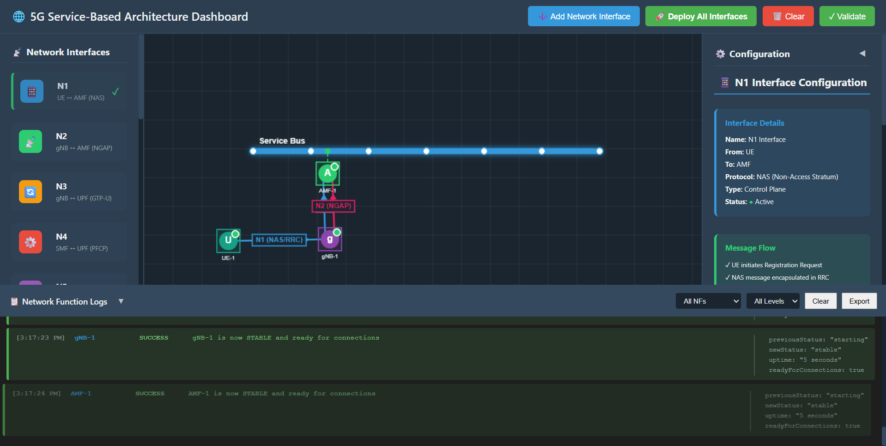
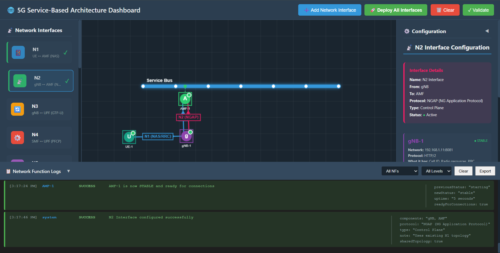
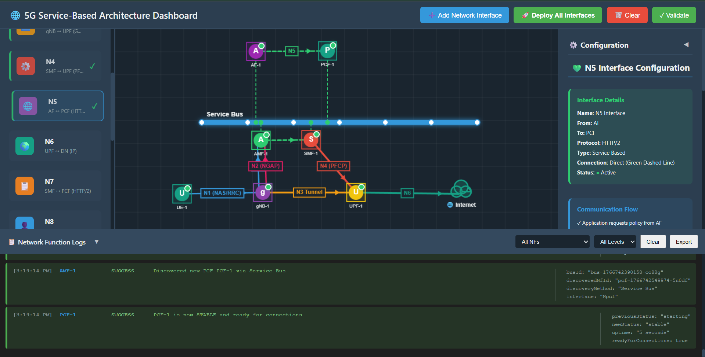
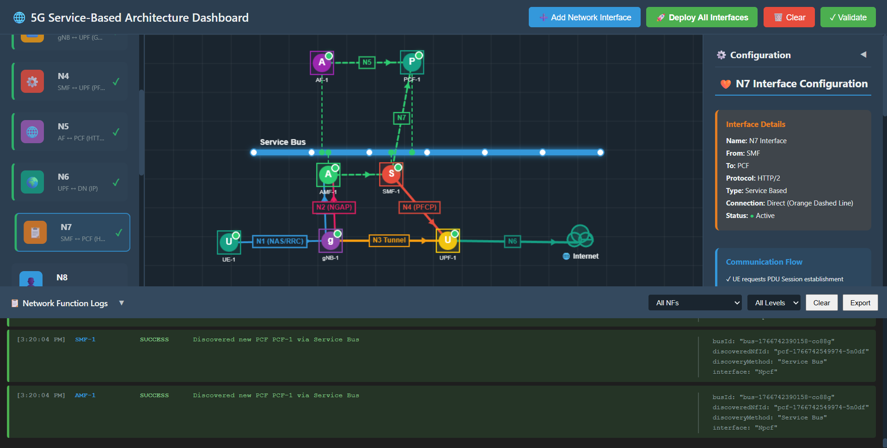
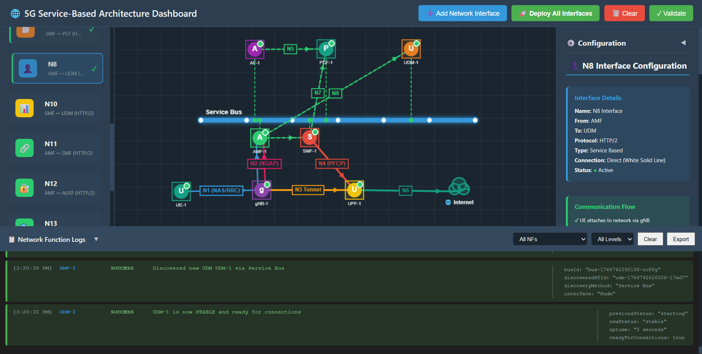
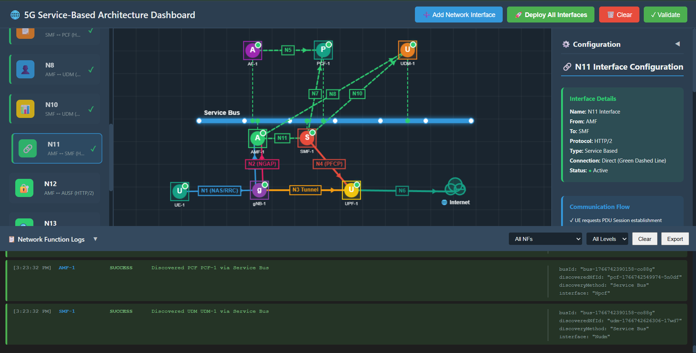
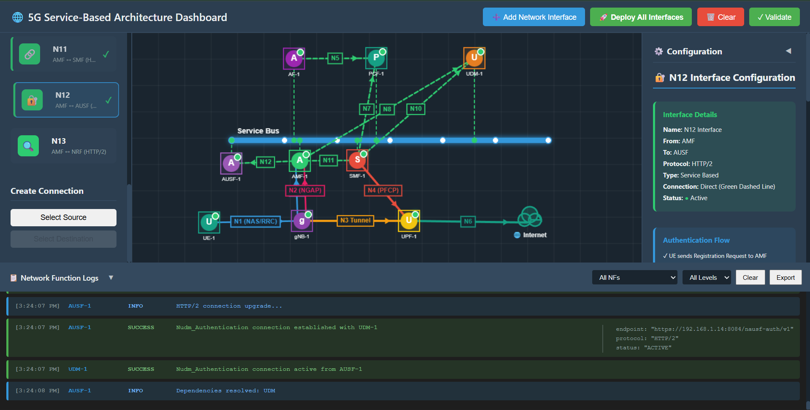
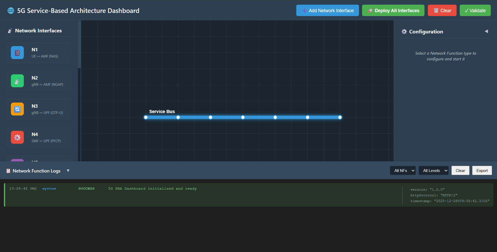
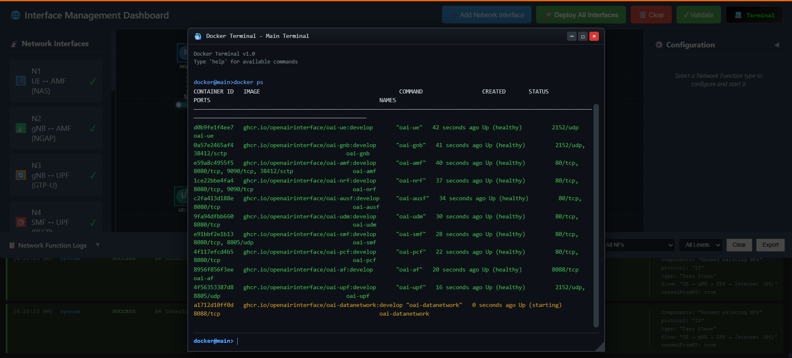
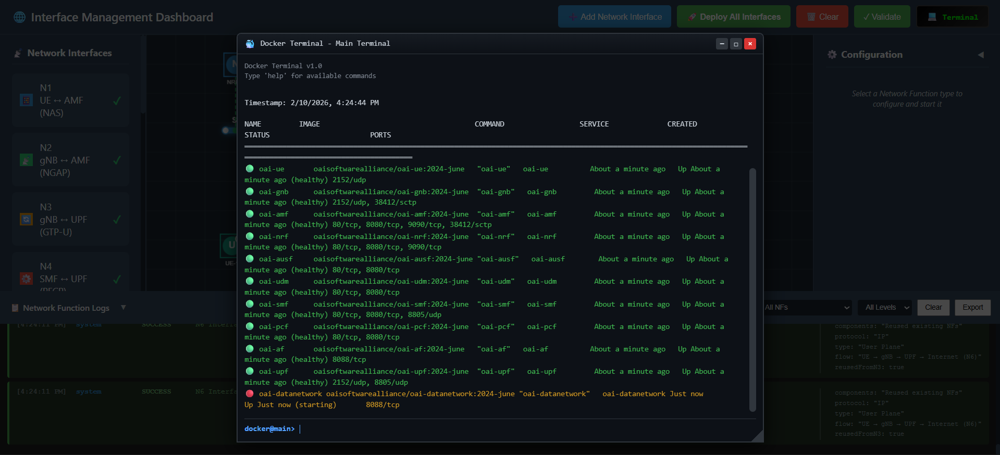

## Deploy  Network Interface

### 1. Deploy N1 Interface (UE ↔ AMF)
-   **Action**: Click on **"N1"** in the left sidebar palette.
-   **Observation**:
    -   **Canvas**: UE, gNB, and AMF appear. A blue connection (N1/NAS) connects UE to gNB, and connected to AMF. AMF connects to the Service Bus.
    -   **Right Panel**: Shows "N1 Interface Configuration" (UE → AMF).
    -   **Logs**: `N1 Interface deployed successfully`.



**Fig: N1 Interface Deployment**

### 2. Deploy N2 Interface (gNB ↔ AMF)
-   **Action**: Click on **"N2"** in the left sidebar.
-   **Observation**:
    -   **Canvas**: Visually reinforces the gNB to AMF connection (NGAP).
    -   **Right Panel**: Shows "N2 Interface Configuration" (gNB → AMF).
    -   **Logs**: `N2 Interface configured successfully` (uses existing N1 topology).



**Fig: N2 Interface Deployment**

### 3. Deploy N3 Interface (gNB ↔ UPF)
-   **Action**: Click on **"N3"** in the left sidebar.
-   **Observation**:
    -   **Canvas**: A UPF appears. An orange line (N3 Tunnel) connects gNB to UPF. The Data Network (Internet) appears connected to UPF.
    -   **Right Panel**: Shows "N3 Interface Configuration" (gNB → UPF).
    -   **Logs**: `N3 Interface deployed successfully` (Data Path established).


**Fig: N3 Interface Deployment**

### 4. Deploy N4 Interface (SMF ↔ UPF)
-   **Action**: Click on **"N4"** in the left sidebar.
-   **Observation**:
    -   **Canvas**: An SMF appears. A red line (N4) connects SMF to UPF. SMF connects to the Service Bus.
    -   **Right Panel**: Shows "N4 Interface Configuration" (SMF → UPF).
    -   **Logs**: `N4 Interface deployed successfully`.


**Fig: N4 Interface Deployment**

### 5. Deploy N5 Interface (AF ↔ PCF)
-   **Action**: Click on **"N5"** in the left sidebar.
-   **Observation**:
    -   **Canvas**: An AF (Application Function) and PCF (Policy Control Function) appear. AF connects to PCF. Both connect to the Service Bus.
    -   **Right Panel**: Shows "N5 Interface Configuration" (AF → PCF).
    -   **Logs**: `N5 Interface deployed successfully`.



**Fig: N5 Interface Deployment**

### 6. Deploy N6 Interface (UPF ↔ DN)
-   **Action**: Click on **"N6"** in the left sidebar.
-   **Observation**:
    -   **Canvas**: Reinforces the connection between UPF and Data Network (Internet).
    -   **Right Panel**: Shows "N6 Interface Configuration" (UPF → DN).
    -   **Logs**: `N6 Interface deployed successfully`.


**Fig: N6 Interface Deployment**

### 7. Deploy N7 Interface (SMF ↔ PCF)
-   **Action**: Click on **"N7"** in the left sidebar.
-   **Observation**:
    -   **Canvas**: Updates connections between SMF and PCF (Logic).
    -   **Right Panel**: Shows "N7 Interface Configuration" (SMF → PCF).
    -   **Logs**: `N7 Interface deployed successfully`.



**Fig: N7 Interface Deployment**

### 8. Deploy N8 Interface (AMF ↔ UDM)
-   **Action**: Click on **"N8"** in the left sidebar.
-   **Observation**:
    -   **Canvas**: A UDM (Unified Data Management) appears and connects to the Service Bus.
    -   **Right Panel**: Shows "N8 Interface Configuration" (AMF → UDM).
    -   **Logs**: `N8 Interface deployed successfully`.



**Fig: N8 Interface Deployment**

### 9. Deploy N10 Interface (SMF ↔ UDM)
-   **Action**: Click on **"N10"** in the left sidebar.
-   **Observation**:
    -   **Canvas**: Updates logical connections for SMF to access Subscription specific data.
    -   **Right Panel**: Shows "N10 Interface Configuration" (SMF → UDM).
    -   **Logs**: `N10 Interface deployed successfully`.


**Fig: N10 Interface Deployment**

### 10. Deploy N11 Interface (AMF ↔ SMF)
-   **Action**: Click on **"N11"** in the left sidebar.
-   **Observation**:
    -   **Canvas**: Creates a dashed green line between AMF and SMF (SBI).
    -   **Right Panel**: Shows "N11 Interface Configuration" (AMF → SMF).
    -   **Logs**: `N11 Interface deployed successfully`.



**Fig: N11 Interface Deployment**

### 12. Deploy N12 Interface (AMF ↔ AUSF)
-   **Action**: Click on **"N12"** in the left sidebar.
-   **Observation**:
    -   **Canvas**: An AUSF (Authentication Server Function) appears and connects to the Service Bus.
    -   **Right Panel**: Shows "N12 Interface Configuration" (AMF → AUSF).
    -   **Logs**: `N12 Interface deployed successfully`.



**Fig: N12 Interface Deployment**

### 13. Deploy N13 Interface (AMF ↔ NRF)
-   **Action**: Click on **"N13"** in the left sidebar.
-   **Observation**:
    -   **Canvas**: An NRF (Network Repository Function) appears and connects to the Service Bus.
    -   **Right Panel**: Shows "N13 Interface Configuration" (AMF → NRF).
    -   **Logs**: `N13 Interface deployed successfully` (AMF discovers SMF/UDM via NRF).


**Fig: N13 Interface Deployment**


---

## Deploy  Network Interface (Automatic)

Click the **"🚀 Deploy All Interfaces"** button on the top toolbar. 
This acts as a "Fast Forward" button that executes Steps 1 through 13 automatically in sequence.




**Fig: Core Network Deployment**

## Check Running services by terminal

**To verify that all containers are running successfully, execute:**

```bash
docker ps
```



**To continuously monitor the status of the core network containers, use:**

```bash
watch docker compose -f docker-compose.yml ps -a
```
