## Deploy  Network Interface

### 1. Deploy N1 Interface (UE ↔ AMF)
-   **Action**: Click on **"N1"** in the left sidebar palette.
-   **Observation**:
    -   **Canvas**: UE, gNB, and AMF appear. A blue connection (N1/NAS) connects UE to gNB, and connected to AMF. AMF connects to the Service Bus.
    -   **Right Panel**: Shows "N1 Interface Configuration" (UE → AMF).
    -   **Logs**: `N1 Interface deployed successfully`.

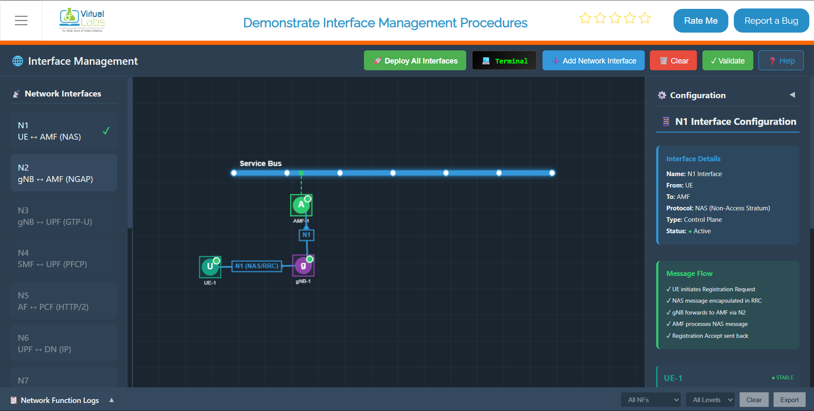

*Fig: N1 Interface Deployment*

### 2. Deploy N2 Interface (gNB ↔ AMF)
-   **Action**: Click on **"N2"** in the left sidebar.
-   **Observation**:
    -   **Canvas**: Visually reinforces the gNB to AMF connection (NGAP).
    -   **Right Panel**: Shows "N2 Interface Configuration" (gNB → AMF).
    -   **Logs**: `N2 Interface configured successfully` (uses existing N1 topology).

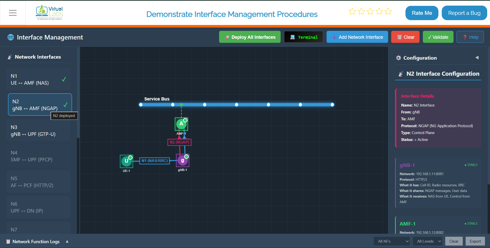

*Fig: N2 Interface Deployment*

### 3. Deploy N3 Interface (gNB ↔ UPF)
-   **Action**: Click on **"N3"** in the left sidebar.
-   **Observation**:
    -   **Canvas**: A UPF appears. An orange line (N3 Tunnel) connects gNB to UPF. The Data Network (Internet) appears connected to UPF.
    -   **Right Panel**: Shows "N3 Interface Configuration" (gNB → UPF).
    -   **Logs**: `N3 Interface deployed successfully` (Data Path established).

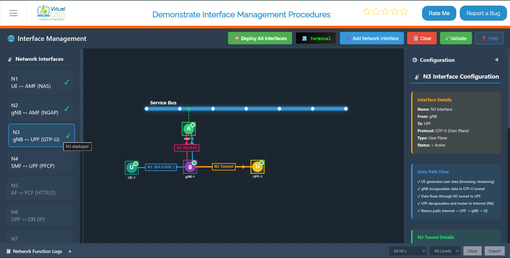

*Fig: N3 Interface Deployment*

### 4. Deploy N4 Interface (SMF ↔ UPF)
-   **Action**: Click on **"N4"** in the left sidebar.
-   **Observation**:
    -   **Canvas**: An SMF appears. A red line (N4) connects SMF to UPF. SMF connects to the Service Bus.
    -   **Right Panel**: Shows "N4 Interface Configuration" (SMF → UPF).
    -   **Logs**: `N4 Interface deployed successfully`.

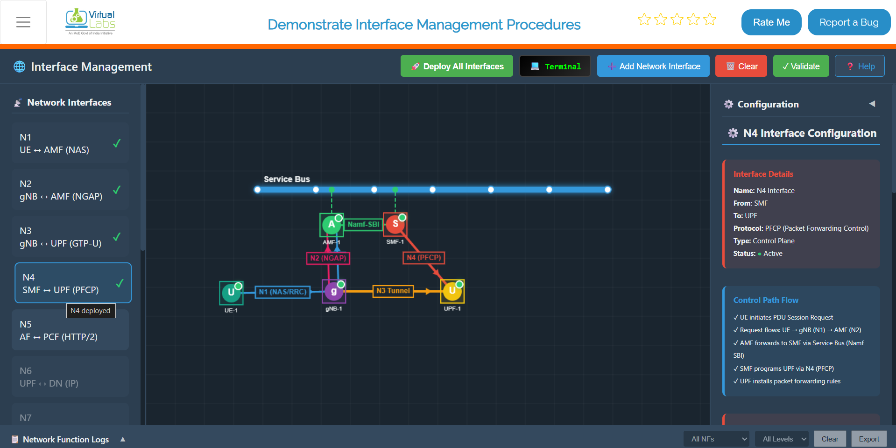

*Fig: N4 Interface Deployment*

### 5. Deploy N5 Interface (AF ↔ PCF)
-   **Action**: Click on **"N5"** in the left sidebar.
-   **Observation**:
    -   **Canvas**: An AF (Application Function) and PCF (Policy Control Function) appear. AF connects to PCF. Both connect to the Service Bus.
    -   **Right Panel**: Shows "N5 Interface Configuration" (AF → PCF).
    -   **Logs**: `N5 Interface deployed successfully`.

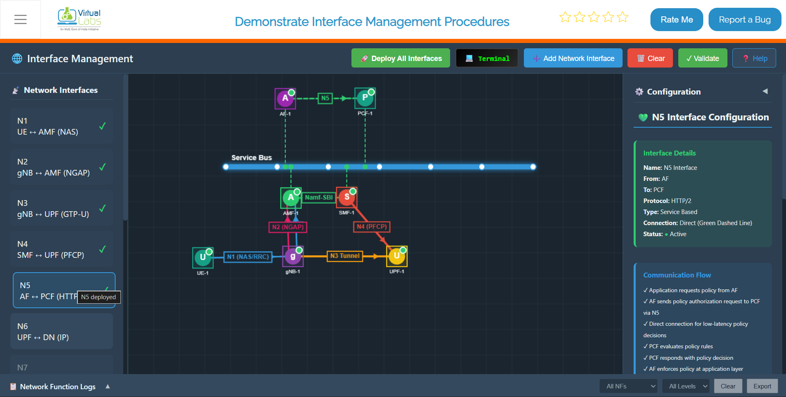

*Fig: N5 Interface Deployment*

### 6. Deploy N6 Interface (UPF ↔ DN)
-   **Action**: Click on **"N6"** in the left sidebar.
-   **Observation**:
    -   **Canvas**: Reinforces the connection between UPF and Data Network (Internet).
    -   **Right Panel**: Shows "N6 Interface Configuration" (UPF → DN).
    -   **Logs**: `N6 Interface deployed successfully`.

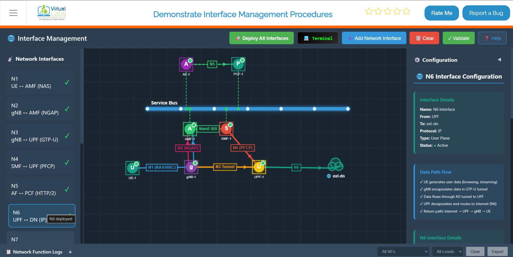

*Fig: N6 Interface Deployment*

### 7. Deploy N7 Interface (SMF ↔ PCF)
-   **Action**: Click on **"N7"** in the left sidebar.
-   **Observation**:
    -   **Canvas**: Updates connections between SMF and PCF (Logic).
    -   **Right Panel**: Shows "N7 Interface Configuration" (SMF → PCF).
    -   **Logs**: `N7 Interface deployed successfully`.

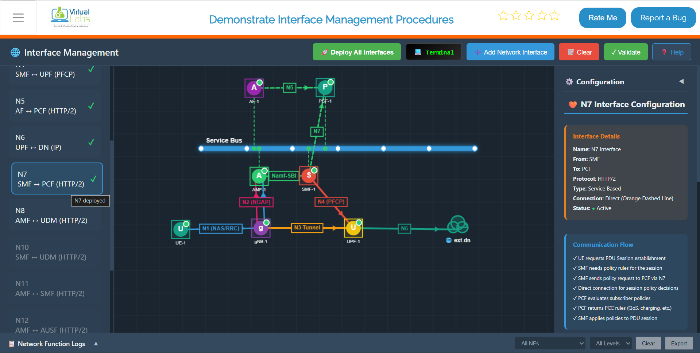

*Fig: N7 Interface Deployment*

### 8. Deploy N8 Interface (AMF ↔ UDM)
-   **Action**: Click on **"N8"** in the left sidebar.
-   **Observation**:
    -   **Canvas**: A UDM (Unified Data Management) appears and connects to the Service Bus.
    -   **Right Panel**: Shows "N8 Interface Configuration" (AMF → UDM).
    -   **Logs**: `N8 Interface deployed successfully`.

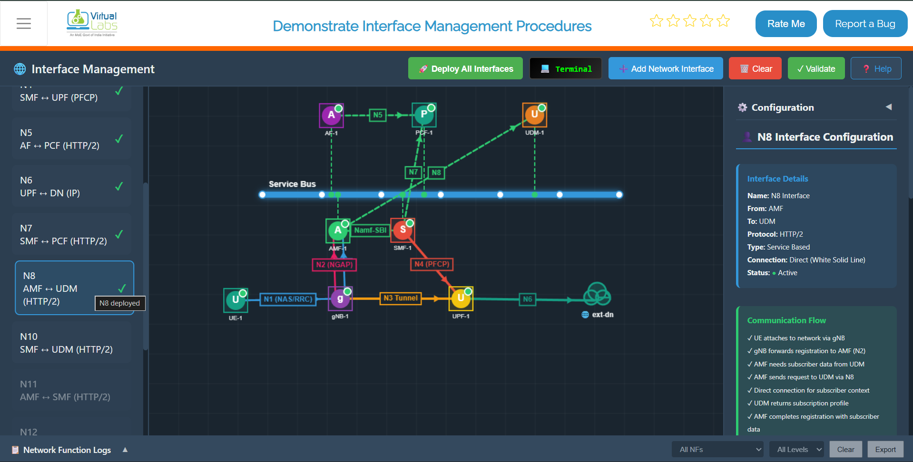

*Fig: N8 Interface Deployment*

### 9. Deploy N9 Interface (UPF ↔ UPF)
-   **Action**: Click on **"N9"** in the left sidebar.
-   **Observation**:
    -   **Canvas**: Updates logical connections between distributed UPFs, showing user-plane traffic forwarding paths between the Intermediate UPF (I-UPF) and the PSA UPF.
    -   **Right Panel**: Shows "N9 Interface Configuration" (UPF → UPF).
    -   **Logs**: `N9 Interface deployed successfully`.

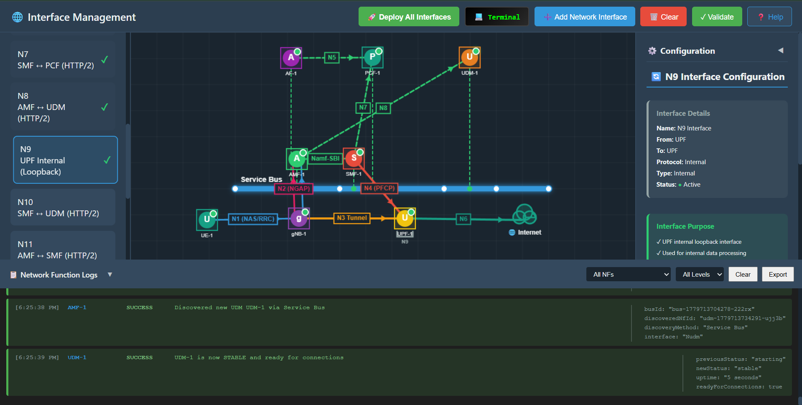

### 10. Deploy N10 Interface (SMF ↔ UDM)
-   **Action**: Click on **"N10"** in the left sidebar.
-   **Observation**:
    -   **Canvas**: Updates logical connections for SMF to access Subscription specific data.
    -   **Right Panel**: Shows "N10 Interface Configuration" (SMF → UDM).
    -   **Logs**: `N10 Interface deployed successfully`.

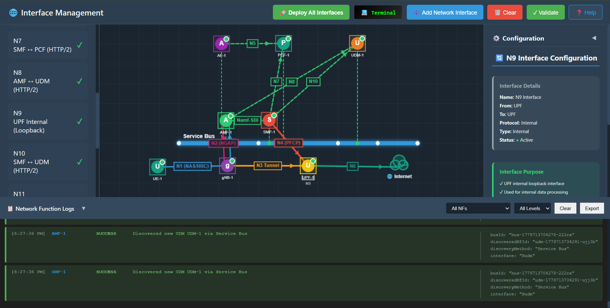

*Fig: N10 Interface Deployment*

### 11. Deploy N11 Interface (AMF ↔ SMF)
-   **Action**: Click on **"N11"** in the left sidebar.
-   **Observation**:
    -   **Canvas**: Creates a dashed green line between AMF and SMF (SBI).
    -   **Right Panel**: Shows "N11 Interface Configuration" (AMF → SMF).
    -   **Logs**: `N11 Interface deployed successfully`.

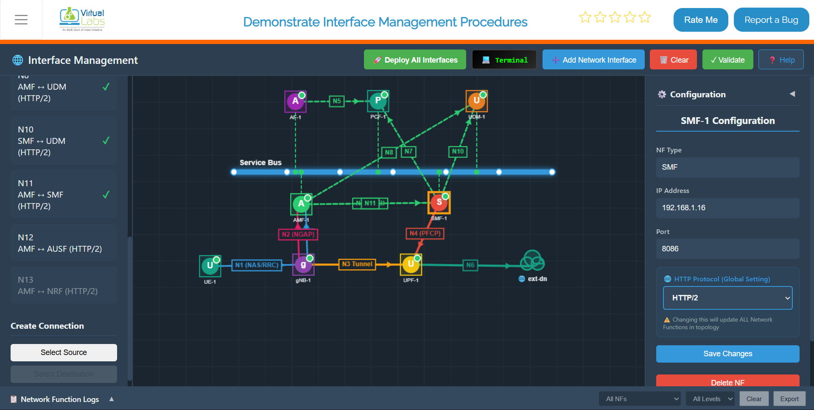

*Fig: N11 Interface Deployment*

### 12. Deploy N12 Interface (AMF ↔ AUSF)
-   **Action**: Click on **"N12"** in the left sidebar.
-   **Observation**:
    -   **Canvas**: An AUSF (Authentication Server Function) appears and connects to the Service Bus.
    -   **Right Panel**: Shows "N12 Interface Configuration" (AMF → AUSF).
    -   **Logs**: `N12 Interface deployed successfully`.

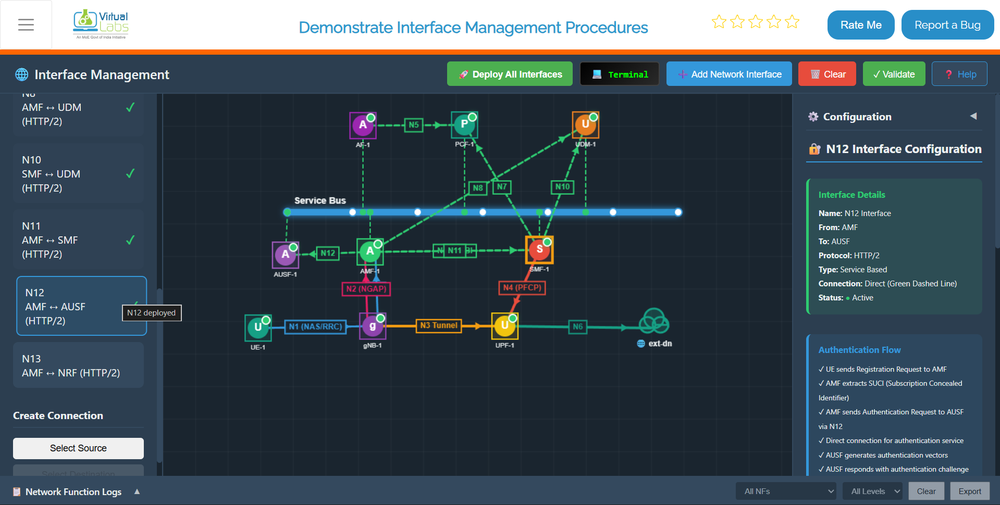

*Fig: N12 Interface Deployment*

### 13. Deploy N13 Interface (AMF ↔ NRF)
-   **Action**: Click on **"N13"** in the left sidebar.
-   **Observation**:
    -   **Canvas**: An NRF (Network Repository Function) appears and connects to the Service Bus.
    -   **Right Panel**: Shows "N13 Interface Configuration" (AMF → NRF).
    -   **Logs**: `N13 Interface deployed successfully` (AMF discovers SMF/UDM via NRF).

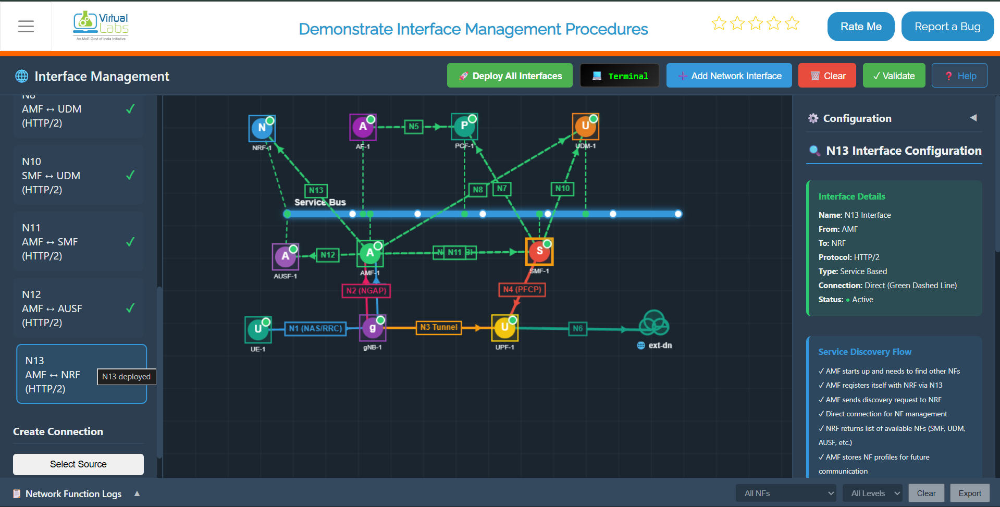

*Fig: N13 Interface Deployment*

## Deploy  Network Interface (Automatic)

Click the **"🚀 Deploy All Interfaces"** button on the top toolbar. 


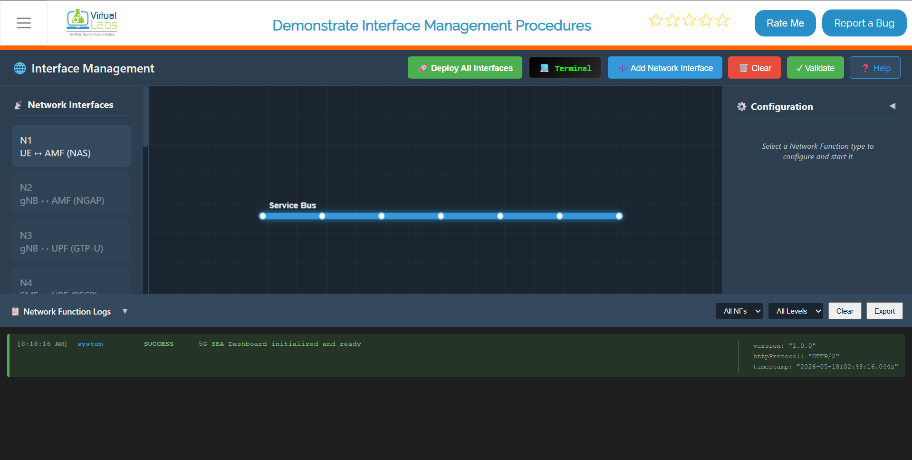

*Fig:Core Network Deployment*

Deploy All Interfaces button on the top toolbar initiating the automated sequential deployment of all N-interfaces.

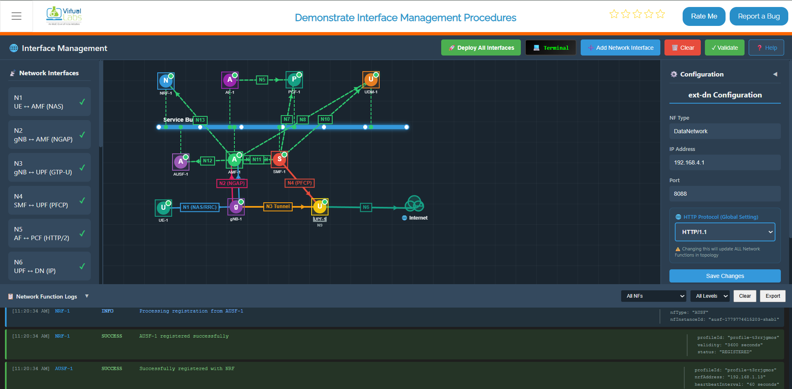

*Fig: Core Network Deployed*

All N-interfaces fully deployed with the complete 5G topology visible on the canvas, showing all network functions (AMF, SMF,UDR, NSSF,  UPF, UDM, AUSF, PCF, AF, NRF) connected via the Service Bus

### Deploy 5G Network Functions (Docker-Terminal):

Click on the **Terminal button** to open the terminal then from the project root directory, execute the deployment commands in the following sequence:

#### Step 1: Deploy Core Network Functions

Execute the following command to start all core network components (AMF, SMF, UPF, NRF, UDM, AUSF, PCF, AF, etc.) in detached mode:

```bash
docker compose -f docker-compose.yml up -d
```

**Command Details:**
- `-f docker-compose.yml`: Specifies the compose file containing the core network configuration
- `up`: Creates and starts containers defined in the compose file
- `-d`: Runs containers in detached mode (background), allowing you to continue using the terminal

**What Gets Deployed:**
This command initializes the foundational service bus and launches all core 5G network functions:
- **AMF** (Access and Mobility Management Function)
- **SMF** (Session Management Function)
- **UDR** (Unified Data Repository)
- **NSSF** (Network Slice Selection Function)
- **UPF** (User Plane Function)
- **NRF** (Network Repository Function)
- **UDM** (Unified Data Management)
- **AUSF** (Authentication Server Function)
- **PCF** (Policy Control Function)
- **AF** (Application Function)


**Verification:**
Wait 10-15 seconds for all containers to initialize. You should see messages indicating successful creation and startup of each component.


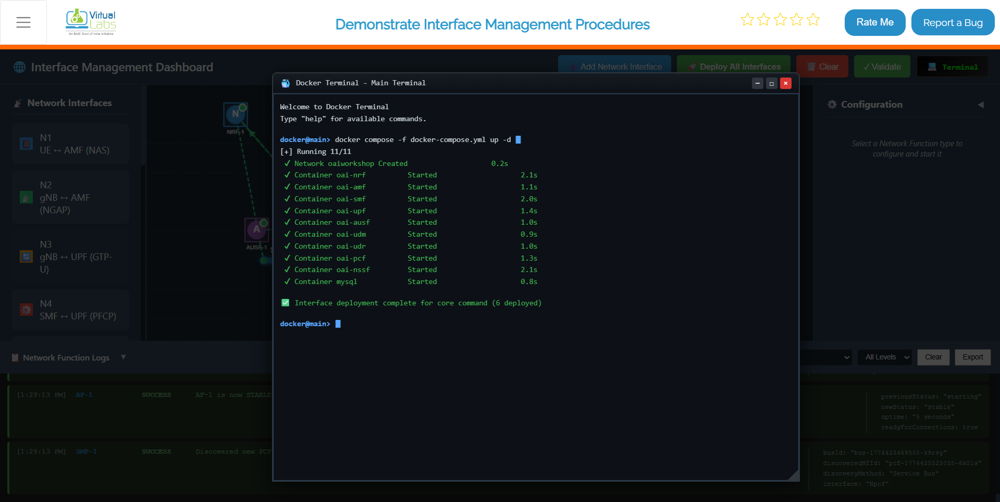

*Fig: Terminal output showing core network deployment initialization*

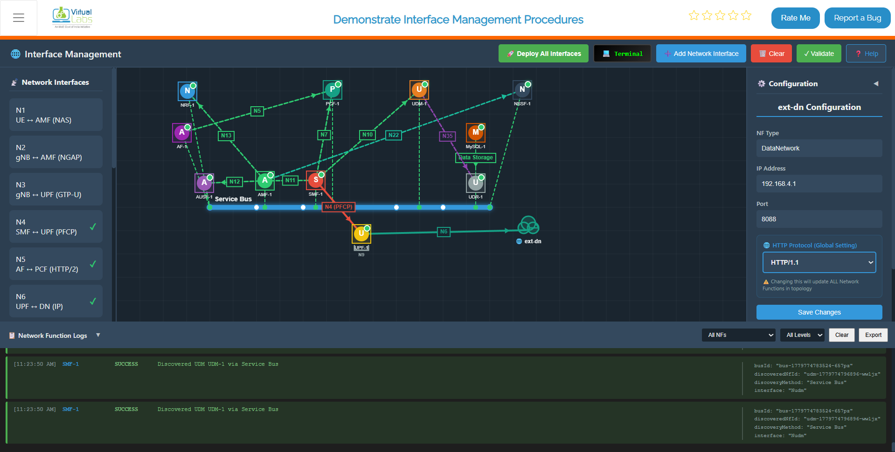

*Fig: Successfully deployed core network with all service bus connections established*

If you deploy the core using the terminal, it will also create two additional network interfaces:
- **N22** between AMF and NSSF
- **N35** between UDM and UDR

---

#### Step 2: Deploy gNB (Base Station)

Once the core network is running and stable, deploy the gNB (base station) services:

```bash
docker compose -f docker-compose-gnb.yml up -d
```

**Command Details:**
- `-f docker-compose-gnb.yml`: Specifies the gNB-specific compose file
- Uses the same network created by the core network deployment
- Automatically connects to the core network's service bus

**What Gets Deployed:**
This command launches the RAN (Radio Access Network) layer:
- **gNB** (5G Base Station) container
- **RIC** (RAN Intelligent Controller) services
- Radio interface handlers for N1, N2, and N3 connectivity

**Network Connections Established:**
- **N1 Interface** (UE ↔ AMF): Via gNB to AMF communication
- **N2 Interface** (gNB ↔ AMF): NGAP protocol for control plane
- **N3 Interface** (gNB ↔ UPF): GTP-U tunnels for data plane traffic


**Verification:**
Wait 5-10 seconds for the gNB to establish connections with the AMF and UPF. Check that heartbeat messages are exchanged with the core network.

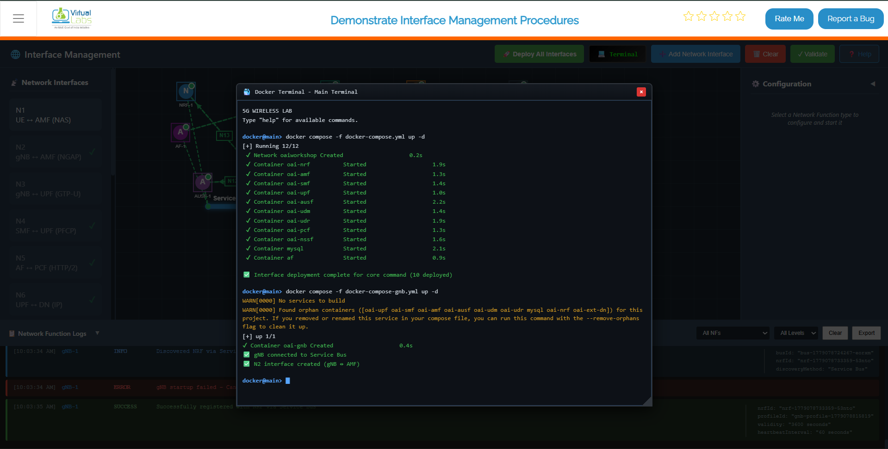

*Fig: Terminal output showing gNB deployment and network connections*

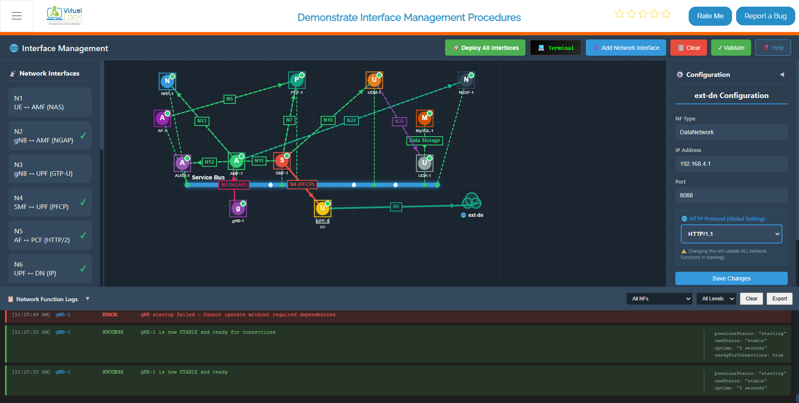

*Fig: gNB fully deployed with established N1, N2, N3 interface connections to core network*

---

#### Step 3: Deploy UE (User Equipment)

After the gNB deployment is complete and verified, deploy the UE (User Equipment) services:

```bash
docker compose -f docker-compose-ue.yml up -d
```

**Command Details:**
- `-f docker-compose-ue.yml`: Specifies the UE-specific compose file
- Configures one or more UE instances to connect to the gNB
- Establishes end-to-end connectivity with the entire 5G network

**What Gets Deployed:**
This command launches one or more user equipment instances:
- **UE Container(s)** - Emulated user devices with 5G capabilities
- **RRC** (Radio Resource Control) handlers
- **NAS** (Non-Access Stratum) protocol stack for control messages
- **IP Stack** for data packet routing


**Verification:**
Wait 15-30 seconds for the complete registration and session establishment process to complete. The UE should successfully:
1. Register with the AMF (N1 messaging)
2. Establish a PDU session with the SMF (N11 messaging)
3. Connect through the UPF to the data network (N6 path)

This completes the end-to-end 5G network topology with all N-interfaces operational.

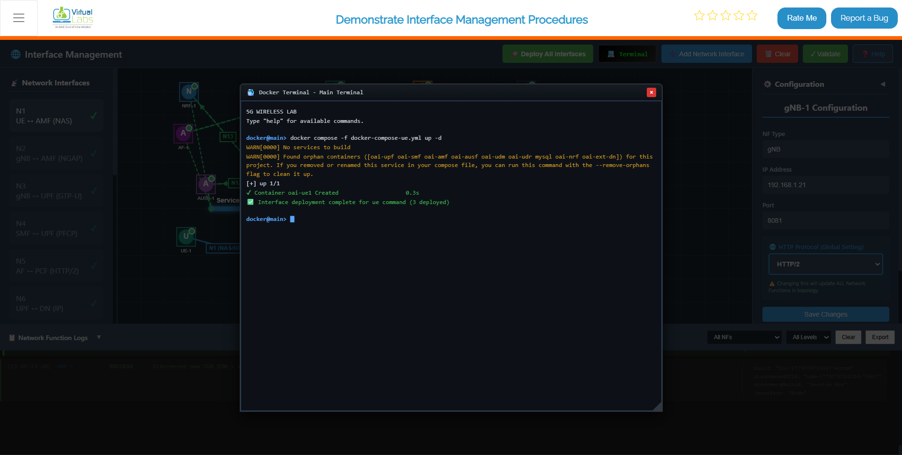

*Fig: Terminal output showing UE deployment and registration process*

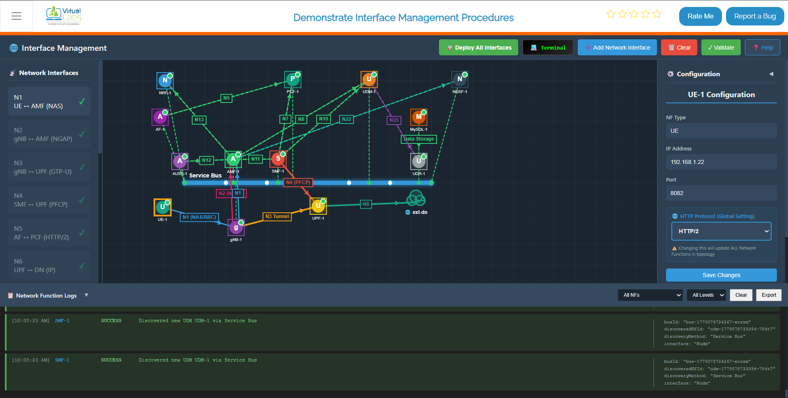

*Fig: Complete 5G network operational with UE successfully registered and connected to data network*


## Verify and Monitor Deployed Services

After completing all three deployment steps, verify that all containers are running correctly and monitor their status.

### Step 1: List All Running Containers

**To verify that all containers are running successfully, execute:**

```bash
docker ps
```

**Expected Output:**
This command displays a table with columns:
- `CONTAINER ID`: Unique identifier for each container
- `IMAGE`: The Docker image each container is running from
- `COMMAND`: The entrypoint command
- `CREATED`: When the container was created
- `STATUS`: Current state (e.g., "Up 5 minutes")
- `PORTS`: Published ports (if any)
- `NAMES`: Human-readable container names


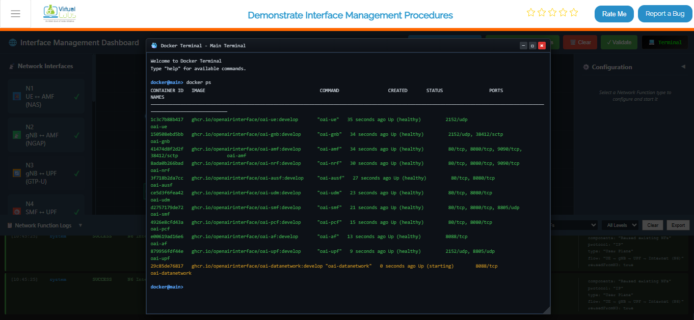

*Fig: Docker PS command output showing all deployed 5G network containers in running state*

---

### Step 2: Continuously Monitor Core Network Status

**To continuously monitor the status of the core network containers and their health, use:**

```bash
watch docker compose -f docker-compose.yml ps -a
```

**Command Details:**
- `watch`: Refreshes the output every 2 seconds (use `-n 5` to change interval to 5 seconds)
- `docker compose ps -a`: Shows status of all services in the compose file
- Press `q` to exit the watch mode

**What Each Column Shows:**
- `NAME`: Service name from the compose file
- `COMMAND`: Startup command for the service
- `STATE`: Running, Dead, Exited, etc.
- `PORTS`: Port mappings and protocols
- `STATUS`: Health status and uptime


**Exit Watch Mode:**
Press `Ctrl+C` on Windows or Mac to stop the continuous monitoring.

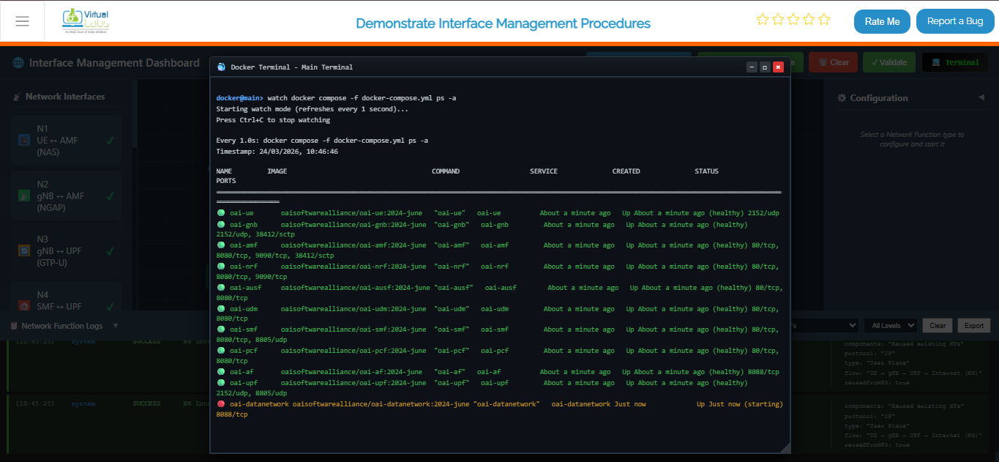

*Fig: Continuous monitoring view of core network services with live status updates*


