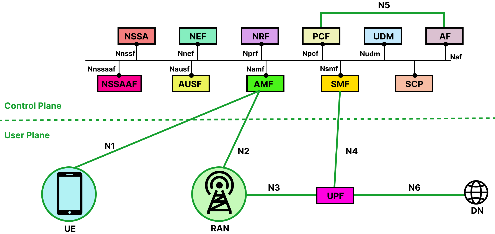
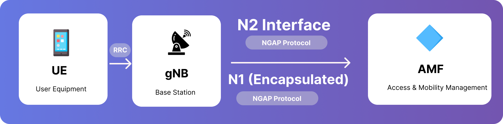
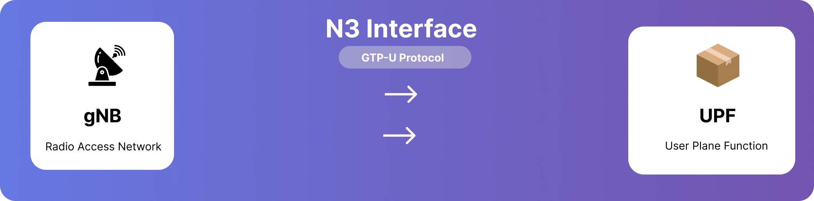
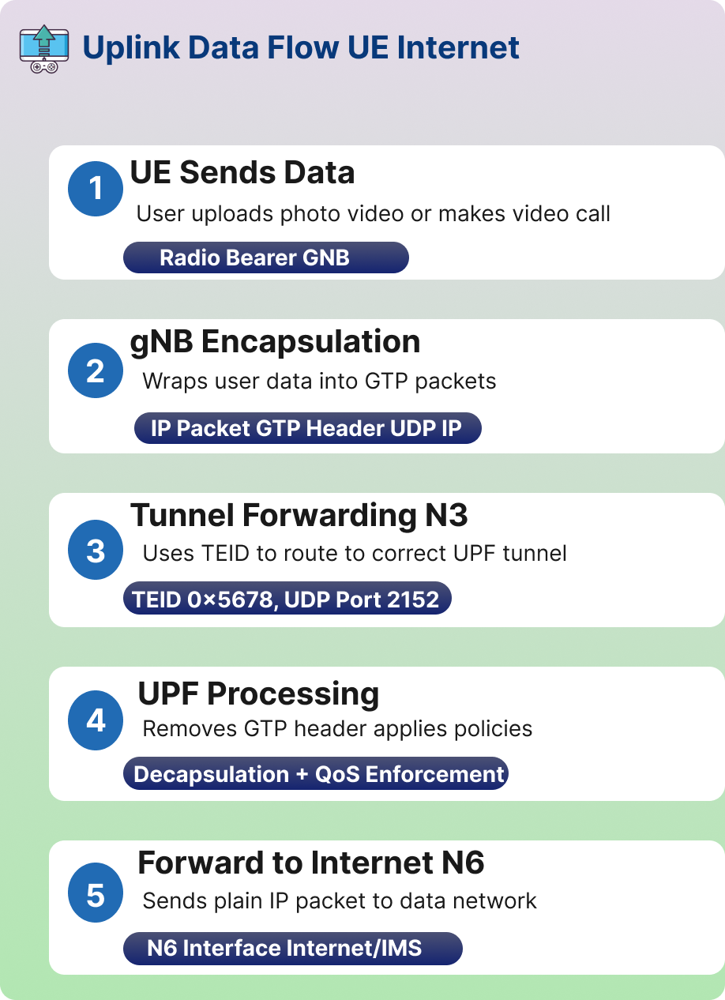
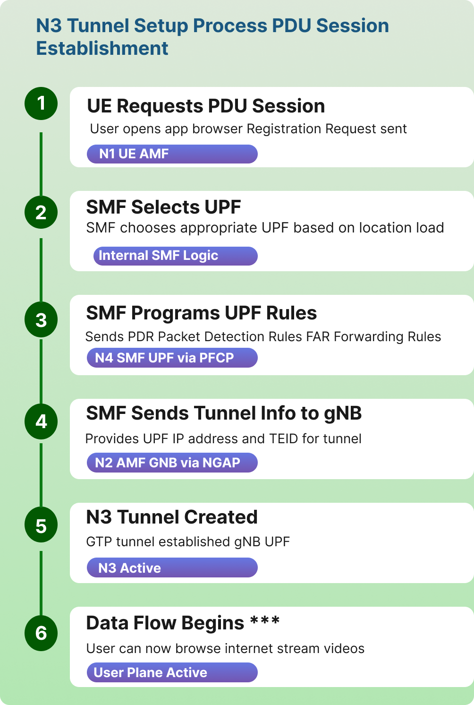
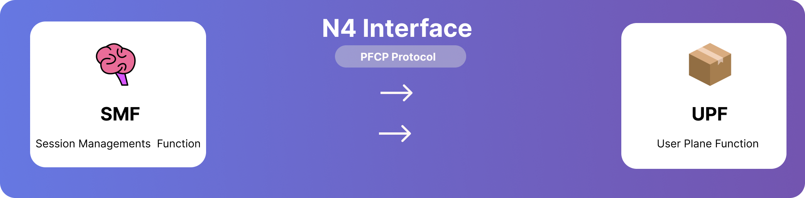
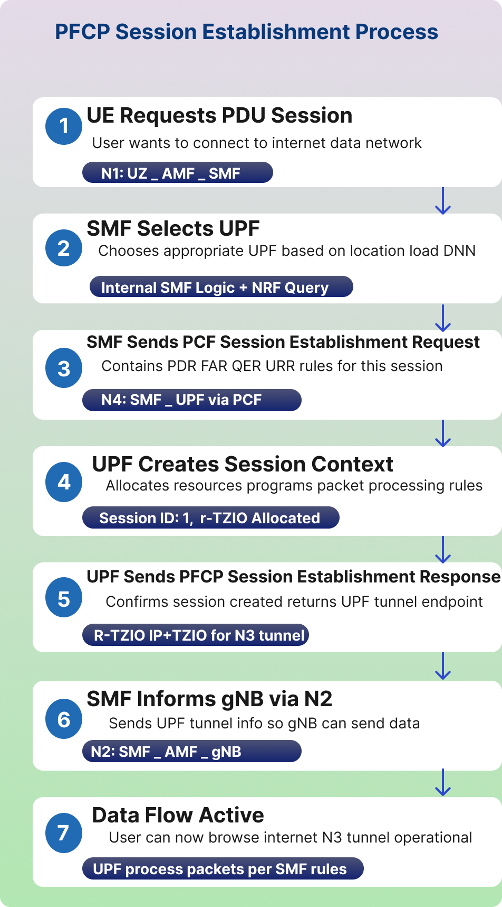
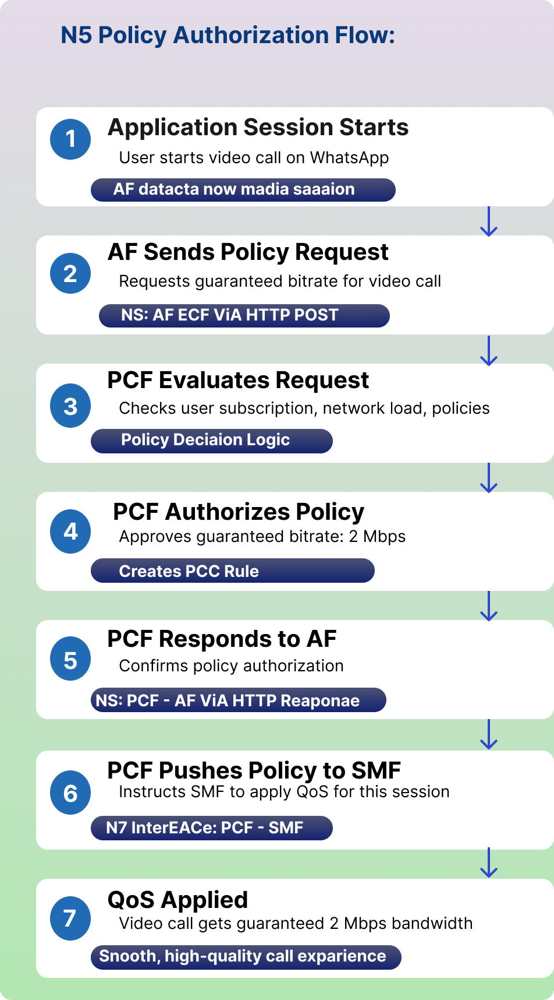
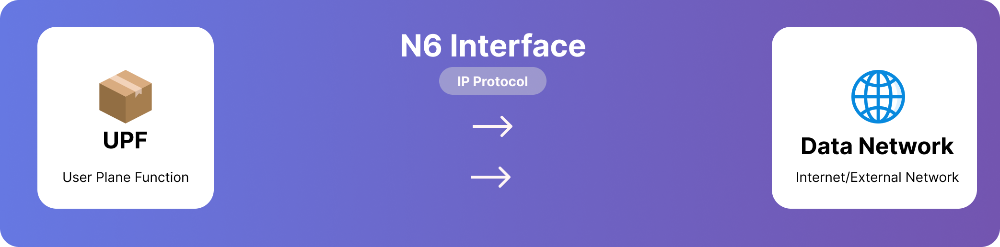
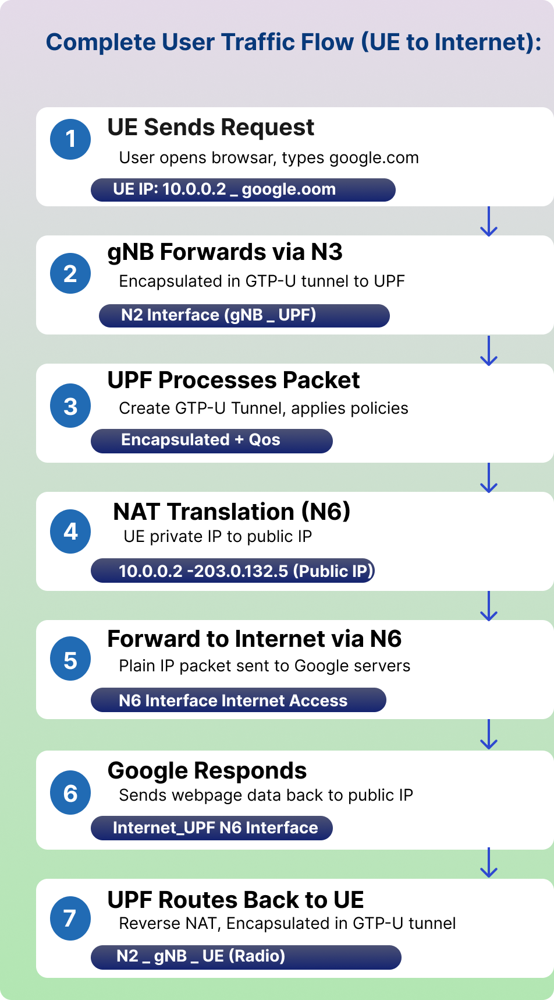

## Introduction to 5G Networks

Consider a 5G network as a big company where various departments must communicate with one another in order to complete tasks. In 5G, various parts known as "network functions" that perform particular tasks must communicate with one another via standardized connections. These connections, which go by the names N1, N2, N3, and so forth, are referred to as interfaces.

Let's first examine the key participants in a 5G network before delving into the interfaces:

- **User equipment (UE)**: This is your tablet, smartphone, or any other gadget that is linked to the 5G network.
- **gNB (Next Generation NodeB)/RAN(Radio Access Network)**: This is the 5G base station, the tower or antenna that your phone connects to wirelessly. It's the radio access point.
- **AMF (Access and Mobility Management Function)**: Think of this as the reception desk. It handles your device's registration, authentication (making sure you're allowed to use the network), and tracks where your device is.
- **SMF (Session Management Function)**: This is like the logistics manager. It sets up and manages your data sessions, deciding how your internet traffic should be routed.
- **UPF (User Plane Function)**: This is the actual data highway. All your internet traffic (videos, messages, web browsing) flows through here.
- **PCF (Policy Control Function)**: This is the rule maker. It decides what quality of service you get, how much data you can use, and at what speed.
- **UDM (Unified Data Management)**: This is the database that stores all information about subscribers, their subscriptions, and authentication details.
- **DN (Data Network)**: This is the outside world, basically the internet or private networks that you're trying to access.

Now let's see how these components talk to each other.

## 5G Interfaces Overview

| Interface | Between | Purpose | Plane | Key Protocols |
|-----------|---------|---------|-------|---------------|
| N1 | UE ↔ AMF | NAS (Non-Access Stratum) signaling for registration, authentication, and session management. | Control | NAS over 5G NR |
| N2 | gNB ↔ AMF | Control-plane signaling between RAN and core. | Control | NGAP over SCTP |
| N3 | gNB ↔ UPF | User data transfer between RAN and core. | User | GTP-U |
| N4 | SMF ↔ UPF | Control of user plane sessions and policies. | Control | PFCP |
| N5 | PCF ↔ AF | Policy control and QoS management. | Control | REST/HTTP2 |
| N6 | UPF ↔ Data Network (DN) | Interface to external services (Internet, IMS, etc.). | User | IP/GTP-U |
| N7 | SMF ↔ PCF | Policy and charging rules exchange. | Control | REST/HTTP2 |
| N8 | AMF ↔ UDM | User authentication and profile retrieval. | Control | REST/HTTP2 |
| N9 | UPF ↔ UPF | Data forwarding between user plane nodes. | User | GTP-U |
| N10 | SMF ↔ UDM | Subscription and session data management. | Control | REST/HTTP2 |
| N11 | AMF ↔ SMF | Session and mobility coordination. | Control | REST/HTTP2 |
| N12 | AMF ↔ AUSF | Authentication signaling. | Control | REST/HTTP2 |
| N13 | AMF ↔ NRF | Discovery of network functions. | Control | REST/HTTP2 |

<strong>What is the N1 Interface?</strong>

## What is the N1 Interface?

The N1 interface is a logical control-plane interface between the User Equipment (UE) — such as a smartphone, modem, or IoT device — and the Access and Mobility Management Function (AMF) in the 5G Core (5GC) network. It's not a direct physical connection. Your phone actually sends messages through the gNB, which acts like a messenger delivering letters between you and the AMF.

This interface is used to exchange Non-Access Stratum (NAS) messages, which carry all the signaling information necessary for registration, authentication, mobility management, and session establishment. These messages are encrypted for security, so even though they pass through the gNB, the base station cannot read them. gNB only acts as a transparent relay for NAS messages.

### Interface Flow:

1. **Step 1**: UE creates NAS messages (Registration Request)
2. **Step 2**: Sends to gNB via RRC (Radio Resource Control)
3. **Step 3**: gNB encapsulates NAS in NGAP and forwards to AMF via N2
4. **Step 4**: AMF processes NAS message and responds back

### Initial Connection Setup

1. The UE powers on and searches for a 5G cell.
2. It establishes a Radio Resource Control (RRC) connection with the gNB.
3. The UE then sends a NAS Registration Request message, which contains information like IMSI (International Mobile Subscriber Identity) and security parameters.
4. This NAS message is encapsulated inside an RRC message and sent to the gNB.
5. The gNB passes it unchanged to the AMF via the N2 interface using Next Generation Application Protocol (NGAP).

### NAS Message Handling

1. The AMF decapsulates and processes the NAS message.
2. Depending on the message type, the AMF may:
   - Authenticate the user (with AUSF/UDM)
   - Register the UE into the network
   - Allocate a temporary identifier (like 5G Globally Unique Temporary Identity)
   - Coordinate with SMF to establish a data session

### Main NAS Message Types Carried on N1

| Category | Message Example | Purpose |
|----------|-----------------|---------|
| Registration | Registration Request / Accept | Network entry and tracking area registration |
| Authentication | Authentication Request / Response | Mutual authentication |
| Security | Security Mode Command / Complete | Ciphering and integrity setup |
| Session Management | PDU Session Establishment Request | Create a data session |
| Mobility | Service Request / Paging | Reconnect to network |
| Deregistration | Deregistration Request / Accept | Logout or network detach |

## UE (User Equipment) Device Identity & Credentials

In a 5G network, the User Equipment (UE) maintains specific identities and security credentials to ensure secure access and communication with the 5G Core (5GC).

### 1. IMSI (Permanent Identity)
- **Value**: 404-45-1234567890
- **Description**: The International Mobile Subscriber Identity is the permanent, unique identifier for the user. It is stored securely within the SIM/USIM card.

### 2. Security Key ($K_i$)
- **Value**: **************** (Stored Securely)
- **Description**: This is a 128-bit secret key used for authentication. For maximum security, this key never leaves the SIM card; it is used locally to generate session keys during the authentication process.

### 3. Security Capabilities
- **Algorithms**: 128-EEA1/2/3, 128-EIA1/2/3
- **Description**: These define the Encryption (EEA) and Integrity (EIA) algorithms supported by the device. They ensure that data transmitted between the UE and the network is both private and untampered with.

### 4. Device Type
- **Category**: 5G Smartphone
- **Capability**: Capable of eMBB (Enhanced Mobile Broadband).
- **Description**: Indicates the hardware's specific functional category, in this case, optimized for high-speed data transfer and high-capacity mobile broadband.

## 5G Registration Signalling

The registration procedure allows the UE to authenticate, obtain authorized services, and update the network on its location.

### 1. Registration Request (UE → AMF)

When the device powers on or moves to a new Tracking Area, it sends this message to the Access and Mobility Management Function (AMF) via the gNodeB.

| Parameter | Value/Description |
|-----------|-------------------|
| 5GS Mobile Identity | SUCI (Subscription Concealed Identifier): An encrypted version of the permanent identity (SUPI/IMSI) used to prevent eavesdropping over the air. |
| Registration Type | Initial Registration: Used when the device first connects to the network. |
| UE Security Capability | Lists supported encryption and integrity algorithms (e.g., 128-NEA1, 128-NIA1) to establish a secure channel. |
| Requested NSSAI | SST=1 (eMBB): Indicates the user wants to access the Enhanced Mobile Broadband network slice for high-speed data. |

### 2. Registration Accept (AMF → UE)

Once the core network (AUSF/UDM) authenticates the user, the AMF sends this message to confirm the UE is now "Registered".

- **5G-GUTI (Globally Unique Temporary Identity)**: A temporary identity assigned to the UE for all future communication. It replaces the SUCI to ensure privacy and consists of:
  - **GUAMI**: Identifies the specific AMF serving the user (MCC, MNC, AMF ID).
  - **5G-TMSI**: A random 32-bit value unique to that AMF.
- **Allowed NSSAI**: The specific network slices (e.g., SST=1) the network has authorized the user to use based on their subscription.
- **Registration Result**: Confirms the success of the registration and the services granted (e.g., SMS, Voice, Data).

**Key Takeaway: Privacy in 5G**

Unlike previous generations (2G/3G/4G), 5G never sends the permanent IMSI in cleartext. It uses the SUCI for the initial handshake and the 5G-GUTI for all subsequent messaging to protect the user from "IMSI Catcher" attacks.

<strong>What is N2 Interface?</strong>

## What is N2 Interface?

The N2 interface connects the gNB to the AMF. This is where the base station and the core network's brain coordinate activities. When your phone sends a registration request over N1, the gNB uses N2 to forward context information to the AMF and receive instructions back. The N2 interface carries information about radio resources, handover procedures (when you move from one base station to another), and paging messages (when the network is trying to reach your device).

The protocol used here is NGAP (Next Generation Application Protocol). It's specifically designed for this control communication between the radio access network and the core. These messages use IP networks underneath, specifically using SCTP (Stream Control Transmission Protocol) as the transport mechanism. SCTP is chosen because it's reliable like Transmission Control Protocol but has additional features useful for signaling.

### N2 Interface Purpose:

- **Control Plane**: NG Setup, UE Context Management, Handover, Paging
- **Key Functions**: RAN node registration, configuration updates, mobility management

### Features of NGAP (Next Generation Application Protocol)

It is used between the gNB and AMF to manage control-plane signaling. Features of NGAP are listed below:

- Operates over SCTP/IP
- Responsible for setting up and maintaining NG connections
- Transfers NAS messages between UE and AMF
- Supports paging, handover, and context release

### NG Setup Procedure

The NG Setup procedure is the first step when a gNB connects to the AMF.
It allows both sides to exchange configuration information and establish an NG interface for communication.

1. **NG Setup Request** - Sent by the gNB to the AMF when it starts up; Contains gNB ID, supported PLMN (public land mobile network), and tracking area information.
2. **NG Setup Response** - Sent by the AMF if the setup is successful; Includes AMF Name, Served PLMN list, and AMF region info.
3. **Error Indication (if any)** - Sent when the AMF cannot accept the setup (e.g., mismatched PLMN).

Once the NG Setup is complete, the gNB and AMF can start handling UE signaling messages.

## gNB (Base Station) Identity & Core Network Setup

The gNodeB (gNB) serves as the bridge between the User Equipment (UE) and the 5G Core. Before it can handle user traffic, it must identify itself and establish a connection with the Access and Mobility Management Function (AMF).

### 1. What gNB Has (Base Station Identity & Capabilities)

These are the static parameters configured on the base station hardware.

- **Global gNB ID**: gNB-001 (0x000001) — A unique identifier for this specific base station.
- **PLMN Identity**: MCC=999, MNC=70 — Identifies the network operator to which the base station belongs.
- **Coverage Area**: TAC=1 (Tracking Area Code) — Defines the geographical area served by this gNB.
- **Radio Capabilities**: 5G NR, FR1 (sub-6 GHz) — Specifies the supported frequency bands and radio technology used for transmission.

### 2. What gNB Shares with AMF (NG Setup Request)

When a gNB powers up, it initiates an NG Setup Request to the AMF to register itself within the core network.

- **Global RAN Node ID**: gNB-001 — The base station identifier used during the registration process.
- **Supported TA List**: TAC=1, PLMN=999-70 — Informs the AMF of the specific coverage areas and network operators this gNB is currently serving.
- **Paging DRX**: v128 (128 radio frames) — The default paging cycle used for power saving, telling the network how often it should check for incoming calls or data for idle devices.
- **RAN Node Name**: "gNB-Delhi-Central-001" — A human-readable name for easier identification and network management.

### Core Network Response: NG Setup Response

Once the gNodeB sends its setup request, the AMF responds to finalize the interface between the Radio Access Network (RAN) and the 5G Core (5GC).

#### What AMF Provides to gNB (NG Setup Response)

This message confirms that the AMF has accepted the connection and provides the gNodeB with the necessary core network operational parameters.

- **AMF Name**: AMF-Region-1
  - The specific identity of the AMF instance that is accepting and managing the connection for this gNB.
- **Served GUAMI**: PLMN=999-70, AMF-Region=01
  - The Globally Unique AMF Identifier (GUAMI) identifies the pool of AMFs serving the area. It includes the Public Land Mobile Network (PLMN) identity and the specific AMF region.
- **Relative AMF Capacity**: 255 (Maximum)
  - A load-balancing indicator ranging from 0 to 255. A value of 255 indicates this AMF has maximum capacity to handle new UEs compared to other AMFs in the same pool.
- **PLMN Support List**: 999-70 with SST=1 (eMBB)
  - Defines the network operators and specific network slices (like Enhanced Mobile Broadband) that this AMF supports for the connected gNodeB.

### RAN Configuration Update Procedure

In a dynamic 5G environment, the Radio Access Network (RAN) may need to update its configuration—for example, when expanding coverage or adding new frequency bands. This process ensures the Core Network remains synchronized with the hardware in the field.

#### 1. RAN Configuration Update Procedure

This procedure allows a gNodeB to update its application-level configuration data without resetting the entire NG interface.

- **Message Flow**:
  - gNB → AMF: RAN Configuration Update.
  - AMF → gNB: Configuration Update Acknowledgment.
- **Status**: Once the AMF acknowledges the request, the RAN Configuration Update is considered complete.

#### 2. Interactive Demo Parameters

Based on the simulation data, the following parameters are used to trigger and verify a configuration update:

| Parameter | Value / Description |
|-----------|-------------------|
| UE IMSI | 404451234567890: The 15-digit subscriber identity used for the simulation. |
| Extracted PLMN | 404-45: The network operator code (MCC-MNC) derived from the IMSI. |
| Updated TAC | 1: The new or verified Tracking Area Code assigned during the update. |

<strong>What is N3 Interface?</strong>

## What is N3 Interface?

The N3 interface is where the actual data flows. It connects the gNB to the UPF, and this is the path your YouTube videos, WhatsApp messages, and web browsing data take. When you stream a video, the video data comes from the internet through the UPF, then travels over N3 to your gNB, and finally gets transmitted wirelessly to your phone.

The key protocol here is GTP-U (GPRS Tunneling Protocol - User Plane). A tunnel simply means that your data is packaged in a special way so it can be delivered to the right destination. Your data gets wrapped in GTP headers that contain information about which session this data belongs to.

The GTP-U protocol runs over UDP/IP. User Datagram Protocol is used instead of TCP because mobile networks can handle some packet loss, and UDP's lower overhead means better performance for real-time applications. Each data packet from your device gets a tunnel identifier, so even if the gNB is serving thousands of devices, it knows exactly which device each packet belongs to.

The IP addressing here is straightforward: the gNB has an IP address that can reach the UPF, and vice versa. When a data session is established, the SMF tells both the gNB and UPF which tunnel identifiers to use for that specific user's session.

### N3 Interface Purpose:

- **User Plane**: Carries actual user data through GTP-U tunnels
- **Key Function**: High-speed data transport between RAN and Core Network

The N3 interface is responsible for:

- Transporting user traffic (IP packets) between RAN and Core
- Carrying encapsulated PDU (Protocol Data Unit) session data
- Supporting QoS enforcement
- Enabling low-latency paths for applications
- Handling mobility (handover between cells)
- Supporting network slicing and differentiated services

This interface becomes active after a PDU session is established by the SMF.

### Working Principle of the N3 Interface

Data over N3 travels using GTP-U (General packet radio service Tunneling Protocol - User Plane).

1. UE sends uplink data to gNB.
2. gNB wraps the data into GTP-U packets.
3. gNB uses the TEID (Tunnel Endpoint Identifier) to forward the packet to the correct UPF over N3.
4. UPF removes the GTP-U header and forwards the packet to the Data Network (Internet, IMS, etc.) via N6 interface.
5. For downlink, the reverse process happens: UPF → gNB → UE

**Important Point**: The N3 interface carries ONLY user data, NOT control signaling.

Control signaling travels separately:
- UE → gNB via RRC
- gNB → AMF via N2/NGAP
- SMF → UPF via N4 (PFCP)

### Role of N3 in Handover

During inter-gNB handover:

1. Old gNB → New gNB tunnel may be created temporarily (Xn or N2).
2. New gNB requests UPF to switch the path.
3. UPF redirects user traffic to new gNB's N3 interface.

This ensures that there is no call drop or no session interruption.

## 5G Uplink Data Flow (UE → Internet)

This process describes how data generated by a user device (UE) travel through the 5G network to reach the external internet.

1. **UE Sends Data**
   - Action: The user performs an activity such as uploading a photo/video or starting a video call.
   - Mechanism: Data is transmitted over the Radio Bearer to the gNB.

2. **gNB Encapsulation**
   - Action: The base station prepares the data for the core network.
   - Mechanism: It wraps the user data into GTP-U packets.
   - Packet Structure: IP Packet — GTP-U Header — UDP — IP.

3. **Tunnel Forwarding (N3)**
   - Action: Data is routed toward the core network's user plane.
   - Mechanism: Uses the Tunnel Endpoint Identifier (TEID) to ensure data reaches the correct UPF (User Plane Function) tunnel.
   - Technical Details: TEID: 0x5678, UDP Port: 2152.

4. **UPF Processing**
   - Action: The core network processes the incoming stream.
   - Mechanism: The UPF removes the GTP-U header and applies network policies.
   - Functions: Decapsulation and QoS (Quality of Service) Enforcement.

5. **Forward to Internet (N6)**
   - Action: Data exits the mobile network.
   - Mechanism: Plain IP packets are sent to the external data network via the N6 Interface (Internet/IMS).

### N3 Interface: Technical Parameters

The N3 interface is the critical link between the Radio Access Network (gNB) and the User Plane Function (UPF).

- **Protocol**: GTP-U (GPRS Tunneling Protocol - User Plane)
  - The standard encapsulation protocol used to carry user data across the 5G system.
- **Transport**: UDP Port 2152
  - The standard, dedicated port utilized for all GTP-U traffic.
- **TEID (Tunnel Endpoint Identifier)**
  - A 32-bit unique identifier used to multiplex and route packets to the correct PDU session.
- **QoS Flow Identifier (QFI)**
  - A 6-bit value (0-63) that indicates the specific priority level of the traffic, ensuring critical data (like voice) is handled faster than background data.

<strong>What is N4 Interface?</strong>

## What is N4 Interface?

The N4 interface connects the SMF to the UPF. Here, SMF is the manager that decides how data sessions should work, while the UPF is the one actually moving data. So N4 is where the SMF gives instructions to the UPF. When the UE wants to start using data, here's what happens: the AMF tells the SMF "this device wants a session," and the SMF uses N4 to program the UPF with rules about how to handle this device's traffic.

The SMF tells the UPF things like: "For this user, forward their traffic to this internet gateway," or "This user has a premium subscription, so give them higher priority," or "Apply a speed limit of 10 Mbps to this session."

The protocol used is PFCP (Packet Forwarding Control Protocol). It's specifically designed for controlling how the UPF forwards packets. The SMF sends PFCP messages over UDP/IP to the UPF's IP address. These messages contain rules about packet filtering, quality of service, traffic routing, and charging information.

### N4 Interface Purpose:

- **Control Plane**: SMF (brain) controls UPF (worker) on how to handle data packets
- **Key Function**: Session establishment, modification, QoS enforcement, traffic routing

### PFCP Characteristics

- Runs over UDP (port 8805)
- All messages are encoded as TLV (Type-Length-Value)
- Provides "rules" that define user-plane behaviour.

| SMF decides: | UPF executes: |
|--------------|---------------|
| Where the UPF is located | Packet routing & forwarding |
| Routing of the user session | QoS enforcement |
| QoS rules | Traffic filtering |
| Charging rules | Deep packet inspection |
| Traffic steering (to internet, MEC edge app, enterprise network) | Data routing to internet, local DN, or edge servers |

**SMF does not forward packets. UPF does not make decisions.**

### SMF: The Session Controller

The SMF is responsible for managing PDU (Protocol Data Unit) Sessions, including IP address allocation and enforcing quality standards.

#### 1. Core SMF Data & Configurations

The SMF maintains the following information to manage active user sessions:

- **PDU Session Information**:
  - Session ID: 1
  - DNN (Data Network Name): internet (Determines which external network to connect to)
- **QoS Profile**:
  - 5QI: 9 (Non-GBR)
  - Priority: 8 (Defines the quality of service requirements for the session)
- **UE IP Address Pool**:
  - Range: 10.45.0.0/16 (The pool of IP addresses available to assign to devices)
- **Policy Rules (from PCF)**:
  - Includes Charging, Rate Limits, and Filters received from the Policy Control Function.

#### 2. PFCP Session Establishment (SMF → UPF)

To handle actual data traffic, the SMF sends specific rules to the UPF via the Packet Forwarding Control Protocol (PFCP).

| Rule Type | Details & Purpose |
|-----------|------------------|
| PDR (Packet Detection Rules) | Match: UE IP 10.45.0.2, N3 TEID. Used to identify which incoming packets belong to this specific session. |
| FAR (Forwarding Action Rules) | Action: Forward to N6, Apply QoS. Dictates what the UPF should do with matched packets. |
| QER (QoS Enforcement Rules) | Max Bitrate: 100 Mbps, GBR: None. Sets speed limits and quality guarantees for the traffic. |
| URR (Usage Reporting Rules) | Report: Every 1 GB or 1 hour. Specifies when the UPF should send data usage reports to the SMF for billing purposes. |

### N4 Working Principle

N4 follows the Control and User Plane Separation (CUPS) architecture.

1. SMF is the brain (makes policies).
2. UPF is the worker (executes rules).
3. SMF programs UPF rules using PFCP.
4. UPF never makes policy decisions on its own.
5. Every user session has a PFCP session.
6. Every PFCP session has rules (PDR, FAR, QER, URR).
7. User-plane forwarding changes only when SMF updates N4 rules.

<strong>What is N5 Interface?</strong>

## What is N5 Interface?

The N5 interface connects the AF (Application Function) to the PCF (Policy Control Function). This interface is used when applications (like video services, gaming apps, enterprise apps, edge applications) need to request specific network policies.

For example, video streaming service like Netflix or a video calling application like Zoom, might want to tell the network "I need better quality for this user's video call" or "This video stream needs priority."

The PCF uses N5 to receive these requests from application providers and then makes decisions about whether to grant them. If a video calling app requests low latency for a call, the AF sends this request to the PCF over N5. The PCF then evaluates this against the user's subscription and network policies. If approved, the PCF will instruct the SMF (over N7) to apply appropriate quality of service rules.

The protocol used here is HTTP/2-based RESTful APIs. The AF and PCF exchange JSON-formatted messages over secure HTTPS connections. Each has its IP address on the network, and the AF knows how to reach the PCF through configuration.

### N5 Interface Purpose:

- **Policy Control**: AF requests network policies for application-specific QoS
- **Key Function**: Dynamic policy authorization based on application needs

### 1. Application Function (AF)

The AF represents external applications requiring specific network behaviors.

- **Application Server**: Includes Video Streaming, Gaming, and IMS (IP Multimedia Subsystem).
- **Service Requirements**: The application communicates its needs to the network, such as Low Latency, High Bandwidth, and Guaranteed Bitrate.
- **Session Information**: Contains details regarding the application session, including UE IP, Media Type, and Flow Description.
- **Real-World Examples**: Netflix, YouTube, and WhatsApp Call using the N5 interface.

### 2. Policy Control Function (PCF)

The PCF serves as the Policy Decision Point for the network.

- **Policy Decision**: Responsible for authorizing or rejecting application requests based on whether the requested QoS can be provided.
- **QoS Rules**: Defines quality of service parameters, including 5QI, Bitrate, and Priority Level.
- **Charging Rules**: Dictates how to bill for the service, supporting both Online and Offline Charging.
- **Traffic Control**: Manages how traffic is handled through Gating, Redirection, and Bandwidth Limits.

### 3. N5 Interface Technical Parameters

The N5 interface is the reference point defined between the PCF and an AF. In the Service-Based Architecture (SBA), it is represented by the Npcf_PolicyAuthorization service.

| Parameter | Details |
|-----------|---------|
| Connected Entities | PCF (Policy Control Function) and AF (Application Function) |
| Primary Protocol | HTTP/2 (standard for all 5G Service-Based Interfaces) |
| Data Format | JSON (JavaScript Object Notation) |
| Key Service Operations | Create, Update, Delete, and Notify for policy authorizations |
| Security | Protected via TLS (Transport Layer Security) for secure control plane communication |

### N5 – Working Principle

1. UE starts an application (e.g., video streaming).
2. The application server (AF) detects this and wants higher quality.
3. AF sends a Policy Authorization Request to PCF via N5.
4. PCF reviews:
   - Subscriber profile
   - Current network load
   - Allowed services
5. PCF decides:
   - QoS
   - Priorities
   - Traffic routing
6. PCF sends policy rules to SMF (via N7) to enforce in UPF.
7. UPF implements:
   - QoS flow
   - Traffic filters
   - Routing changes

<strong>What is N6 Interface?</strong>

## What is N6 Interface?

The N6 interface is the connection between the UPF and the Data Network (internet). This is the exit point from the 5G network. After the data travels through N3 from the gNB to the UPF, it then goes out through N6 to reach the internet.

The UPF acts as a router here. The UE device is assigned an IP address that it uses to communicate with internet servers. This IP address assignment happens during session establishment, with the SMF coordinating the process.

The UPF performs NAT (Network Address Translation) or routes your traffic based on the network design. It also applies any filtering or policy enforcement that the PCF has specified. For instance, if a subscription doesn't include access to certain services, the UPF blocks that traffic here at N6.

When UE request a webpage, it's IP packet travels through N3 (wrapped in GTP), gets unwrapped at the UPF, and then goes out N6 as a regular IP packet to the web server. The response follows the reverse path.

### N6 Interface Purpose:

- **Gateway**: Connects 5G Core Network to external data networks (Internet, IMS Enterprise Networks)
- **Key Function**: Routes user traffic between 5G network and outside world

### Responsibilities of N6

N6 enables the delivery of user traffic (data packets) from the 5G network to external networks, and vice-versa.

It handles:

- IP packet routing
- Traffic steering (e.g., to MEC)
- Packet filtering
- QoS enforcement

### 1. Application Function (AF)

The AF is a control plane network function that provides application-related information to the 5G Core. It can be a trusted application residing within the operator's network or an external third-party application.

**Role and Responsibilities:**

- **Service Exposure**: It exposes application-layer requirements to 5G network resources.
- **Traffic Routing**: It can influence traffic routing by providing information to the PCF or the Network Exposure Function (NEF).
- **Event Subscription**: Authorized network functions can subscribe to the AF for notifications regarding application events, such as user mobility or service experience.

**Application Types**: Typical applications include high-bandwidth video streaming (e.g., Netflix), low-latency gaming, and mission-critical voice services (IMS).

### 2. Policy Control Function (PCF)

The PCF acts as the primary rule-maker for the network, serving as a unified policy framework that governs network behavior.

**Key Functions:**

- **QoS Management**: It defines Quality of Service (QoS) rules, such as bitrates and priority levels, to meet the specific requirements of different network slices (e.g., eMBB, URLLC).
- **Policy Decision**: It authorizes or rejects service requests based on the subscriber's data and available network resources.
- **Mobility and Slicing Control**: The PCF manages policies for network slicing, roaming, and mobility management for all control plane functions.
- **Charging Rules**: It dictates how sessions should be billed, supporting both real-time online and traditional offline charging.

### 3. N6 Interface Overview

The N6 interface is the reference point between the User Plane Function (UPF) and the Data Network (DN). It is the final exit point for user traffic leaving the mobile core and the entry point for data returning from the internet or other services.

- **Primary Function**: Provides connectivity between the UPF and external or internal networks, such as the public Internet, private enterprise clouds, or IP Multimedia Subsystems (IMS).
- **Encapsulation**: At this interface, the UPF performs GTP-U decapsulation for uplink traffic (removing the 5G-specific headers) and forwards plain IP packets to the Data Network.

### 4. Connected Data Networks (DNNs)

Data networks are identified by a Data Network Name (DNN), which tells the 5G Core which specific external network a user is attempting to access. Common DNNs include:

| DNN | Purpose |
|-----|---------|
| internet | Standard public internet access for browsing and general apps. |
| ims | IP Multimedia Subsystem for voice (VoNR) and carrier messaging. |
| enterprise | Private networks for corporate employees or internal industrial systems. |
| iot | Dedicated networks for massive machine-type communications and sensors. |

### 5. Technical Interface Parameters

The N6 interface relies on standard IP routing and network-level protocols rather than 3GPP-specific encapsulation.

- **Protocol Stack**: Plain IPv4, IPv6, or dual-stack IPv4v6 packets.
- **Routing**: The UPF acts as an IP router, often using static routes or dynamic routing protocols (like BGP) to exchange information with external routers behind the N6 interface.
- **NAT (Network Address Translation)**:
  - **Function**: Maps private UE IP addresses (e.g., from the 10.45.0.0/16 pool) to public global IP addresses.
  - **Types**: Supports various configurations including NAT44, NAT64 (for IPv6-to-IPv4 transition), and NAPT (port translation).
- **Packet Inspection**: The UPF performs Deep Packet Inspection (DPI) at the N6 border to enforce content policies and detect malware.

### Working Principle of N6

1. UE generates data (e.g., browsing, video, IoT traffic).
2. Data reaches the gNB using N3.
3. gNB forwards traffic to UPF via N3.
4. UPF applies:
   - Packet routing and forwarding
   - QoS rules (QoS Flow → PDR rules)
   - Traffic filtering
   - Charging rules
   - UL CL (uplink classifier)
5. UPF forwards user traffic to DN via N6.

**Downlink (reverse direction):**
External network → UPF → gNB → UE.

<strong>Complete 5G Signalling Summary</strong>

## Complete 5G Signalling Summary

To summarize, here is a consolidated view of the primary IDs and messages discussed across all sections:

| Entity | Identity Used | Key Message Sent/Received |
|--------|---------------|---------------------------|
| User (UE) | IMSI, SUCI, 5G-GUTI | Registration Request / Accept |
| Base Station (gNB) | Global gNB ID | NG Setup Request |
| Core (AMF) | GUAMI, AMF Name | NG Setup Response |
| Interface (NG) | TAC, PLMN | RAN Config Update |

## Key Network Functions Summary

### 1. User Equipment (UE) Identity & Registration

The UE manages permanent and temporary identities to maintain security and privacy within the 5G network.

**UE Identity & Credentials:**

- **IMSI (Permanent Identity)**: 404-45-1234567890. This is the International Mobile Subscriber Identity stored securely in the SIM card.
- **Security Key ($K_i$)**: A 128-bit secret key used for authentication that never leaves the SIM.
- **Security Capabilities**: Supports encryption and integrity algorithms 128-EEA1/2/3 and 128-EIA1/2/3.
- **Device Type**: 5G Smartphone capable of eMBB (Enhanced Mobile Broadband).

**Registration Procedure:**

- **Registration Request (UE → AMF)**:
  - Type: Initial Registration.
  - SUCI (Concealed IMSI): Privacy-protected subscriber identity.
  - Requested Service: NSSAI: SST=1 (eMBB).
- **Registration Accept (AMF → UE)**:
  - 5G-GUTI: Temporary identity for privacy (MCC=404, MNC=45, AMF-ID=01, TMSI=12345).
  - Tracking Area: Assigned TAC=1.
  - Update Timer: Periodic registration update interval set to 54 minutes.

### 2. Radio Access Network (gNB) & AMF Setup

Before handling traffic, the gNodeB (gNB) must establish a relationship with the Access and Mobility Management Function (AMF).

**gNB Identity & Capabilities:**

- **Global gNB ID**: gNB-001 (0x000001).
- **Radio Capabilities**: 5G NR, FR1 (sub-6 GHz).
- **NG Setup Request**: The gNB shares its Global RAN Node ID and Supported TA List (TAC=1, PLMN=999-70) with the AMF.

**AMF Response to gNB:**

- **Served GUAMI**: Provides the Globally Unique AMF Identifier (PLMN=999-70, AMF-Region=01).
- **Relative AMF Capacity**: 255 (Maximum load balancing indicator).
- **PLMN Support List**: Confirms support for 999-70 with SST=1 (eMBB).

### 3. Session Management & User Plane Flow

Once registered, the Session Management Function (SMF) controls the data path through the User Plane Function (UPF).

**SMF (Session Controller):**

- **PDU Session Info**: Session ID 1, DNN "internet".
- **QoS Profile**: 5QI: 9 (Non-GBR), Priority 8.
- **UE IP Pool**: 10.45.0.0/16.
- **PFCP Rules (SMF → UPF)**:
  - PDR (Packet Detection): Matches packets via UE IP 10.45.0.2 and N3 TEID.
  - FAR (Forwarding): Actions include forwarding to N6 and applying QoS.
  - QER (QoS Enforcement): Max Bitrate 100 Mbps.
  - URR (Usage Reporting): Reports every 1 GB or 1 hour.

**UPF (Packet Processing Worker):**

- **Packet Classification**: Identifies sessions using PDR rules.
- **Traffic Forwarding**: Routes packets to N3, N6, or N9 interfaces.
- **QoS Enforcement**: Applies rate limiting and prioritization.
- **Usage Monitoring**: Counts bytes and reports to SMF for billing.

### 4. Data Flow & Interface Parameters

**Uplink Data Flow (UE → Internet):**

1. UE Sends Data: Via Radio Bearer to gNB.
2. gNB Encapsulation: Wraps data into GTP-U packets (IP - GTP-U - UDP - IP).
3. Tunnel Forwarding (N3): Uses TEID: 0x5678 and UDP Port: 2152.
4. UPF Processing: Performs decapsulation and QoS enforcement.
5. Forward to Internet (N6): Sends plain IP packets to the data network.

**N3 Interface Technicals:**

- **Protocol**: GTP-U (GPRS Tunneling Protocol - User Plane).
- **TEID**: 32-bit unique identifier to route packets to the correct PDU session.
- **QFI (QoS Flow Identifier)**: 6-bit value (0-63) indicating traffic priority.

**N4 Interface Technicals:**

- **Protocol**: PFCP (Packet Forwarding Control Protocol).
- **Transport**: UDP Port 8805 (Default port for PFCP communication).
- **Message Types**: Session: Establish/Modify/Delete (PFCP manages entire session lifecycle).
- **Session Context**: F-SEID (Fully Qualified Session ID) (Unique identifier: IP + Session ID).

 