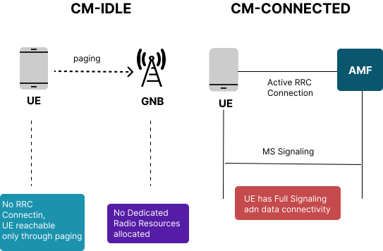
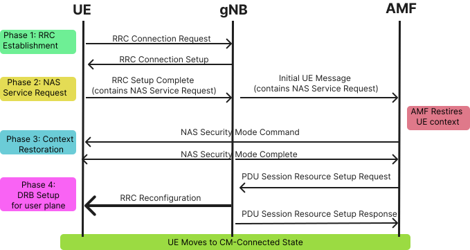
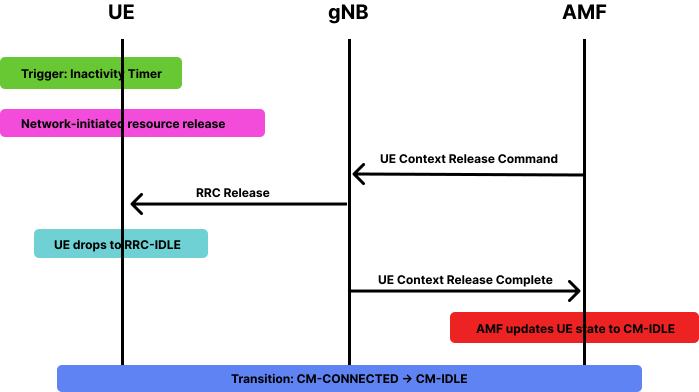

> **Audio Explanations:** For a more comprehensive understanding of these theoretical concepts, supplementary audio guides are available on YouTube.
> 
> - [**Listen in English**](https://youtu.be/nQvkmXDgf3I)
> - [**Listen in Hindi**](https://youtu.be/QkOU5yTaTxw)

## 1. 5G Connection Management (CM)

Connection Management (CM) is one of the fundamental **Non-Access Stratum (NAS)** functions in the 5G Core network. It defines how a **User Equipment (UE)** establishes, maintains, suspends, and resumes signaling connectivity with the **Access and Mobility Management Function (AMF)**.

This connectivity is required not only for user data delivery but also for several important network procedures such as **registration updates, authentication, policy enforcement, session management signaling, and mobility handling**.

Compared to 4G LTE, 5G introduces a more efficient design by adopting a **Service-Based Architecture (SBA)**. In this architecture, the control plane (AMF) and user plane (UPF) are separated, allowing flexible management of signaling and data traffic.

To optimize resource usage, the UE signaling connectivity is controlled through two major procedures:

1. **Service Request Procedure** — transitions UE from **CM-IDLE → CM-CONNECTED**
2. **UE Context Release Procedure** — transitions UE from **CM-CONNECTED → CM-IDLE**

Understanding these procedures is important for analyzing **UE behavior, network resource management, and signaling operations** in 5G networks.

## 2. CM States in 5G

In the 5G Core network, **Connection Management (CM)** states describe the signaling connectivity between the **UE and the AMF**.

As illustrated in **Fig 1**, 5G defines two primary CM states that control the UE's connectivity behavior. A UE transitions from the **CM-IDLE** state to the **CM-CONNECTED** state by initiating a Service Request procedure. Conversely, it returns to the **CM-IDLE** state when the network triggers a UE Context Release procedure due to inactivity.

*Fig 1: CM-IDLE vs CM-CONNECTED State Diagram*

### 2.1 CM-IDLE State

In the **CM-IDLE** state, the UE does not maintain an active NAS signaling connection with the AMF.

This state is similar to idle mode in LTE, but 5G introduces improvements such as **optimized paging mechanisms, tracking area management, and RRC Inactive mode**.

When the UE is in CM-IDLE:

- No dedicated **RRC connection** exists between the UE and the gNB.
- The AMF stores only minimal UE context information.
- The UE performs **cell reselection autonomously**.
- The UE monitors **paging channels** for incoming data.
- The UE can access the network through **Random Access Channel (RACH)** when needed.

The CM-IDLE state helps:

- Reduce network signaling overhead
- Save radio resources
- Lower UE power consumption

### 2.2 CM-CONNECTED State

In the **CM-CONNECTED** state, the UE maintains an active signaling connection with the network.

When the UE is in CM-CONNECTED:

- The UE has an **active RRC connection** with the gNB.
- The AMF maintains a **complete UE context** including security keys and session information.
- The UE can immediately send or receive **NAS signaling and user-plane data**.
- The gNB stores **UE-specific RRC configurations and Data Radio Bearers (DRBs)**.
- **Handover procedures** occur when the UE moves between cells.

Although this state enables continuous communication, it consumes more **radio resources and battery power**. Therefore, the network transitions the UE back to **CM-IDLE** when communication is not required.

## 3. Service Request Procedure (CM-IDLE → CM-CONNECTED)

The **Service Request procedure** restores the UE's signaling connectivity and user-plane paths after they have been released due to inactivity.

This procedure frequently occurs in real networks because many applications generate **short bursts of traffic**.

### 3.1 Why Service Request Is Required

When the UE is in **CM-IDLE**:

- UE cannot send **uplink data immediately**
- gNB does not maintain **RRC context**
- Downlink traffic requires **paging**

Therefore, a Service Request is required before communication resumes.

### 3.2 Types of Service Request

#### Mobile-Originated (MO) Service Request

Triggered by the **UE** when:

- Opening an application
- Sending uplink data
- Resuming PDU sessions
- Initiating NAS signaling

#### Mobile-Terminated (MT) Service Request

Triggered by the **network** when downlink data arrives.

Sequence:

1. Data arrives at **UPF**
2. UPF notifies **SMF**
3. SMF informs **AMF**
4. AMF performs **paging**
5. UE responds with Service Request

### 3.3 Service Request Signaling Flow

**Fig 2** illustrates the step-by-step message exchange required for a Service Request. This procedure highlights the interactions between the UE, gNB, AMF, and SMF as they establish the RRC connection, validate security, coordinate session management, and successfully restore the data bearers, thereby moving the UE into the CM-CONNECTED state.

*Fig 2: 5G Service Request Signaling Flow*

The signaling flow consists of the following steps:

- #### Step 1: RRC Connection Establishment

Messages:

- **RRC Connection Request**
- **RRC Connection Setup**
- **RRC Connection Setup Complete**

The final message contains the **NAS Service Request**.

- #### Step 2: NAS Forwarding

The gNB forwards the NAS message to the **AMF via N2 interface**.

AMF identifies UE using:

- **5G-GUTI**
- Stored mobility context

- #### Step 3: Security Validation

AMF performs:

- NAS security verification
- Retrieval of **PDU session context**
- Authorization validation

- #### Step 4: SMF Coordination

If user-plane resources were released:

- AMF contacts **SMF**
- SMF re-establishes **N3 tunnel**
- gNB prepares **DRBs**

- #### Step 5: Data Bearer Setup

AMF sends:

**PDU Session Resource Setup Request**

gNB responds:

**PDU Session Resource Setup Response**

- #### Step 6: UE Becomes CM-CONNECTED

Signaling and data paths are restored.

## 4. UE Context Release Procedure (CM-CONNECTED → CM-IDLE)

The **UE Context Release procedure** moves the UE from **CM-CONNECTED to CM-IDLE** when communication is no longer required.

### 4.1 Why UE Context Release Is Necessary

Maintaining CM-CONNECTED consumes:

- Radio resources
- AMF processing power
- UE battery
- Network memory

Most devices send data only occasionally, so the network releases resources during inactivity.

### 4.2 Trigger Conditions

- #### Inactivity Timer Expiry
Most common trigger when no activity occurs.

- #### UE-Initiated Deregistration
Occurs when UE powers off or enables airplane mode.

- #### Abnormal Conditions
Examples include radio link failure or handover failure.

- #### Policy-Based Release
Operators may configure special policies (e.g., IoT devices).

### 4.3 UE Context Release Flow

**Fig 3** depicts the steps involved in the UE Context Release procedure. It demonstrates how the AMF commands the gNB to release the connection, prompting the gNB to send an RRC Release message to the UE. Once the connection is released and confirmed, the UE transitions back to the resource-saving CM-IDLE state.

*Fig 3: UE Context Release Signaling Flow*

The context release flow consists of the following steps:

- #### Step 1: AMF Command

**UE Context Release Command (AMF → gNB)**

- #### Step 2: gNB Releases Connection

gNB sends **RRC Release** to UE.

UE enters **RRC-IDLE**.

- #### Step 3: Confirmation

gNB sends:

**UE Context Release Complete**

- #### Step 4: UE Moves to CM-IDLE

AMF keeps minimal context:

- Tracking Area
- Paging data
- 5G-GUTI
